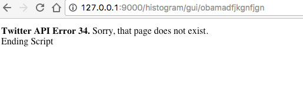

# TwitterHistogramAPI
Project for BigCommerce

# README

### Twitter Hourly Histogram API

##### Description

This project returns an hourly histogram of tweets for a given user for the last 24 hours. 

##### Modes

There are two modes for the main program, JSON and GUI mode. 
The JSON mode returns a JSON object for use in API, and the GUI mode returns the object in text to the brower, along with extra features such as username title, user photo and last tweet. 

##### Usage

###### Part 1
A web application with a single HTTP endpoint that simply returns the text "​ Try /hello/:name"​. That is, if you point a web browser or curl to your application, example (htttp://127.0.0.1:9000), you will see the text "​ Try /hello/:name" ​.

###### Part 2
Another endpoint /hello/<name> that returns the text Hello <name>. For example, visiting http://127.0.0.1:9000/hello/BarackObama  displays the text ​"Hello BarackObama" ​.

###### JSON Mode
Once setup, navigate curl to your server address and port.
 http://(localhost / 127.0.0.1 :<port>)/histogram/<username>

For example
http://127.0.0.1:9000/histogram/9newsAUS

A JSON object will be returned:
{"0":7,"1":8,"2":6,"3":12,"4":14,"5":22,"6":20,"7":14,"8":34,"9":3,"10":1,"11":2,"12":1,"13":1,"14":1,"15":1,"16":1,"17":1,"18":4,"19":14,"20":10,"21":9,"22":10,"23":3}

Each key represents the hour of day of that past 24 hours. The value represents how many tweets in that hour.

###### GUI mode

Much like the JSON mode, the gui mode outputs the histogram, along with extra data like username, user picture and last tweet to a browser.

The address is 
http://(localhost / 127.0.0.1 :<port>)/histogram/gui/<username>

For example:
http://127.0.0.1:9000/histogram/gui/9newsAUS

##### Error handling.

If the twitter API generates an error, the message is formatted to JSON:

{"error":{"msg":"Twitter API error: Not authorized."}}
{"error":{"msg":"Twitter API error: Sorry, that page does not exist.","code":34}}

A similar error is displayed on the GUI mode.

The case where an account exists but there are no tweets, this throws a PHP error.
I did not have time to handle this error, but is a simple future improvement.

##### Installation/dependencies.

The program uses two dependencies packages.

1.	Silex (http://silex.sensiolabs.org/)
Framework for PHP.

2.	twitteroauth (https://twitteroauth.com/)

Twitter API for PHP.

These were both installed using composer, and this is how the files are setup. 
(https://getcomposer.org/)

In the repo is the composer.json file, which will fetch the required dependencies. 

##### Files / Server.

Once the dependencies have been installed with composer, mount the files on your php server with the folder ‘web’ as the document root.

For example on mac with a built in php server:

Cd web
$ php -S 127.0.0.1:9000

This should load index.php

The classes are contained inside getTweets.php

##### Testing.

I did not have time to code test cases, however if I did this would be my process:

Use phpUNIT (https://phpunit.de/) and guzzle to test for:
•	JSON header returned in JSON mode.
•	Valid JSON object returned.
•	Use a separate API program to cross reference the accuracy of the histogram, fed with a list of most active / popular twitter users.

## Screen Shots

JSON Output in curl

GUI Mode

GUI Mode

GUI Error

GUI Error
